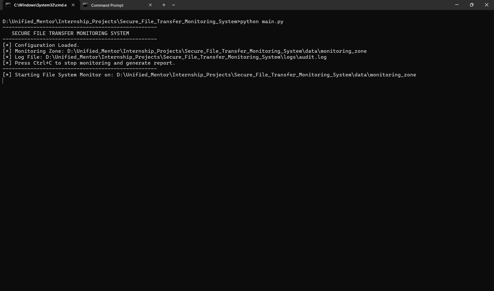
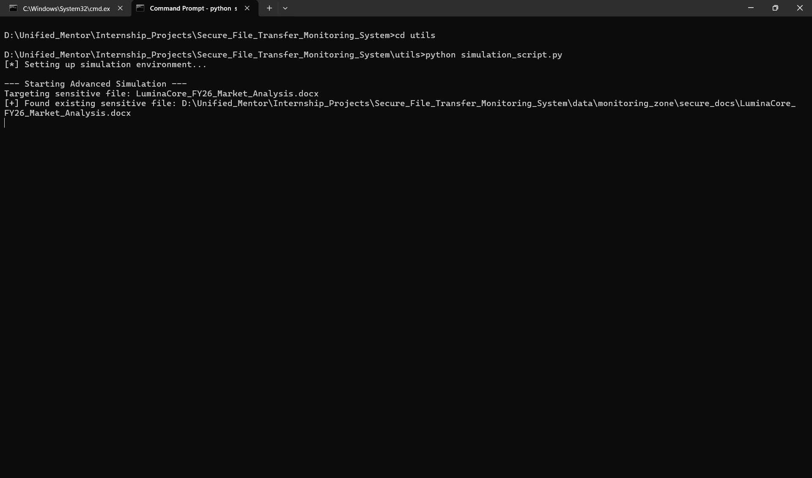
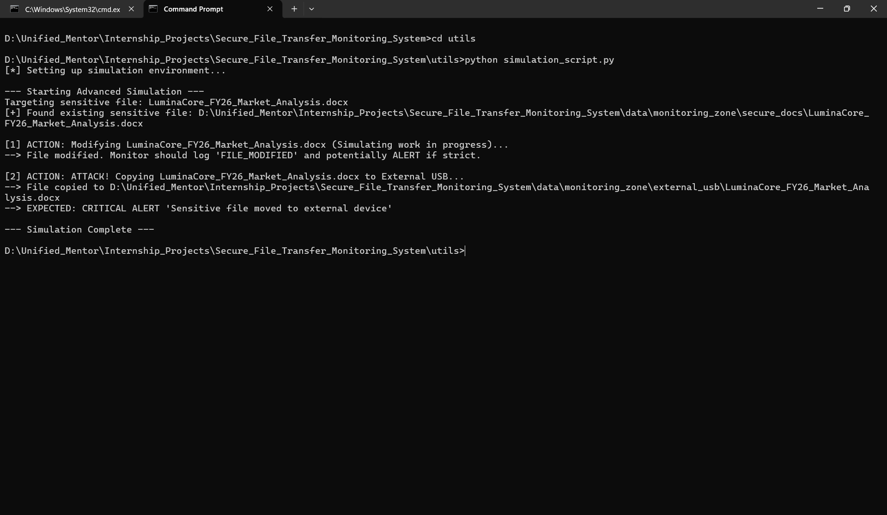
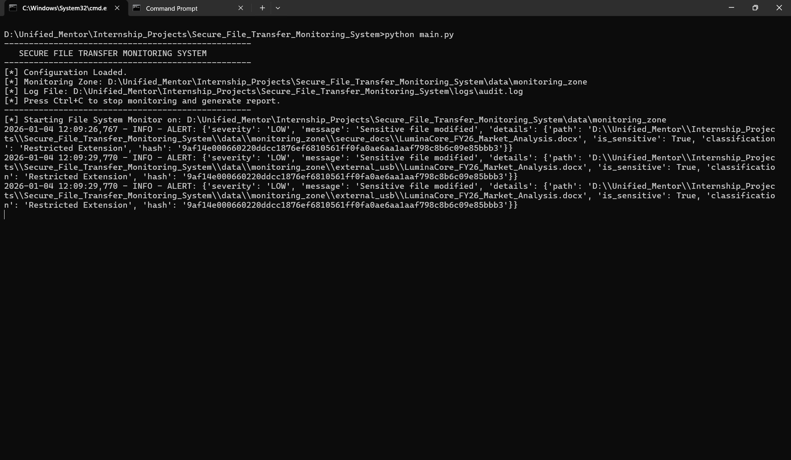
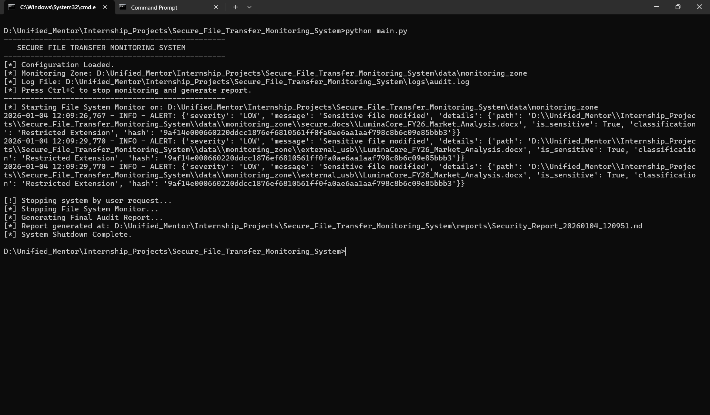
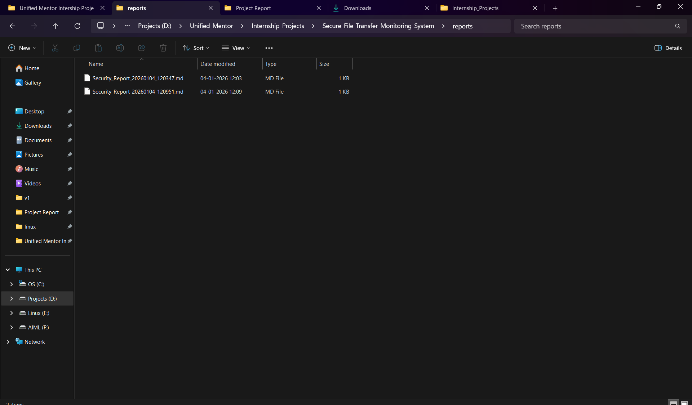
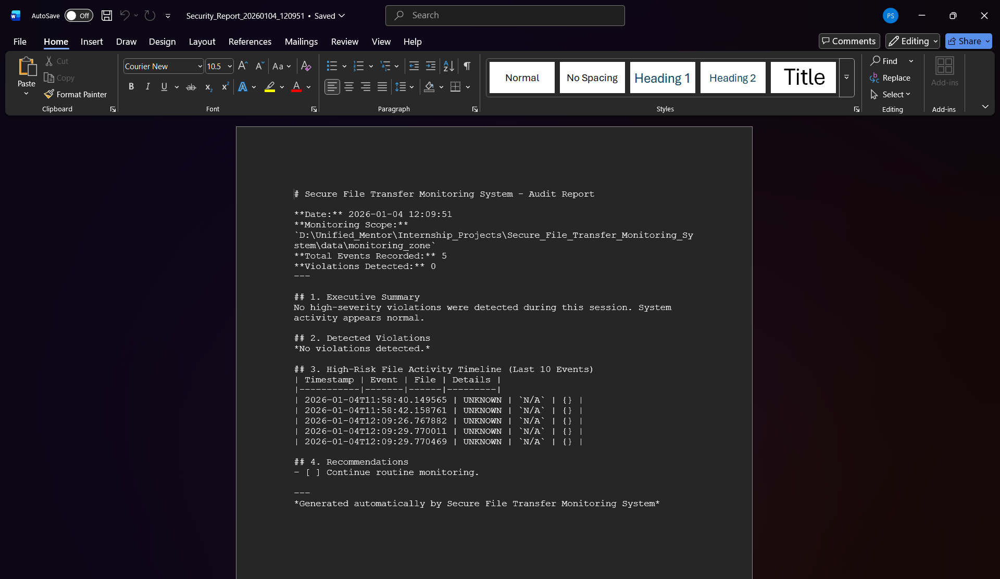

# Secure File Transfer Monitoring System


**Version:** 1.0.0  
**Status:** Monitoring Active  
**License:** Educational / Internship Use Only
---
## 1. Project Overview

The **Secure File Transfer Monitoring System** is a defensive cybersecurity tool designed to monitor, log, analyze, and report file transfer activities across a local file system. It detects unauthorized data movement, integrity violations (via SHA256 hashing), and potential data exfiltration attempts in real-time.

This project follows real-world **SOC (Security Operations Center)** and **DLP (Data Loss Prevention)** principles to provide visibility without interfering with user workflows (read-only/non-blocking).

## 2. Features

- **Real-Time Monitoring**: Detects file creation, modification, deletion, and movement instantly using `watchdog`.
- **Sensitive File Classification**: Automatically tags files based on sensitive extensions (e.g., `.pdf`, `.key`, `.pem`) or keywords (e.g., "secret", "budget").
- **Unauthorized Movement Detection**: Alerts when sensitive files are moved to unapproved locations (simulating external USB drives).
- **Integrity Verification**: Computes SHA256 hashes to detect file tampering during transfer.
- **Structured Logging**: JSON-based logs for easy ingestion by SIEM tools.
- **Automated Reporting**: Generates a professional Markdown audit report at the end of each session.

## 3. Project Structure

```
secure-file-transfer-monitoring-system/
 ├── main.py                  # Entry point
 ├── config/
 │   └── settings.py          # Configuration (Paths, Extensions)
 ├── modules/
 │   ├── file_system_monitor.py   # Watchdog Event Handler
 │   ├── sensitive_file_manager.py # Classification Logic
 │   ├── integrity_checker.py      # Hashing Logic
 │   ├── authorization_engine.py   # Policy Enforcement
 │   ├── alert_manager.py          # Alerting System
 │   ├── logging_engine.py         # Structured Logger
 │   └── report_generator.py       # Report Builder
 ├── logs/                    # Audit logs storage
 ├── reports/                 # Generated audit reports
 ├── data/
 │   └── monitoring_zone/     # Test area for file activity
 └── requirements.txt         # Dependencies
```

## 4. Visual Walkthrough & Gallery

### Initialization

*Figure 1: Tool Initial Execution*


*Figure 2: File System Monitor Initialization*

### Scenario: Unauthorized Data Movement

*Figure 3: Simulation Environment Setup*


*Figure 4: Detects modification of sensitive files (Integrity Check)*


*Figure 5: Detects transfer of sensitive data to "External USB"*


*Figure 6: Real-time Critical Security Alert*

### Reporting

*Figure 7: Final Forensic Audit Report*

## 5. Installation

1. **Clone the repository.**
   ```bash
   git clone https://github.com/pramod-shinde-2303/secure-file-transfer-monitoring-system.git
   ```

2. **Install dependencies:**
   ```bash
   pip install -r requirements.txt
   ```
   *(Requires Python 3.8+)*

## 6. Usage

1. **Start the Monitor:**
   ```bash
   python main.py
   ```
   The system will immediately start watching the configured `data/monitoring_zone`.

2. **Simulate Activity:**
   - Create a file in `data/monitoring_zone`.
   - Rename it to include "secret" (e.g., `secret_project.txt`).
   - Move it to `data/monitoring_zone/external_usb`.

3. **Stop Monitoring:**
   - Press `Ctrl+C`.
   - A report will be generated in `reports/`.

## 6. Architecture & Workflow

1. **Monitor**: The system listens for file system events.
2. **Classify**: Is the file sensitive? (Extension/Keyword check).
3. **Verify**: Compute SHA256 hash.
4. **Authorize**: Check if the movement is allowed by policy.
5. **Alert/Log**: Log the event and trigger an alert if a violation is detected.
6. **Report**: Compile all events into a final summary.

## 7. Safety Disclaimer

> **IMPORTANT**: This tool is for **educational and defensive monitoring purposes only**.
> - It does **NOT** block files.
> - It does **NOT** delete files.
> - It does **NOT** modify files.
> It is designed to be safe and non-intrusive. ensure you have permission to monitor the target directories.

---

## 8. Example Output

**Console Alert:**
```text
!!! CRITICAL SECURITY ALERT !!!
Sensitive file moved to external device
Details: {'path': '.../secret.pdf', 'is_sensitive': True}
```

**Audit Report:**
```markdown
| Timestamp | Severity | Message | Path |
|-----------|----------|---------|------|
| 2026-01-04... | HIGH | Sensitive file moved to external device | ... |
```

---
*Developed for Cyber Security Internship Task*
